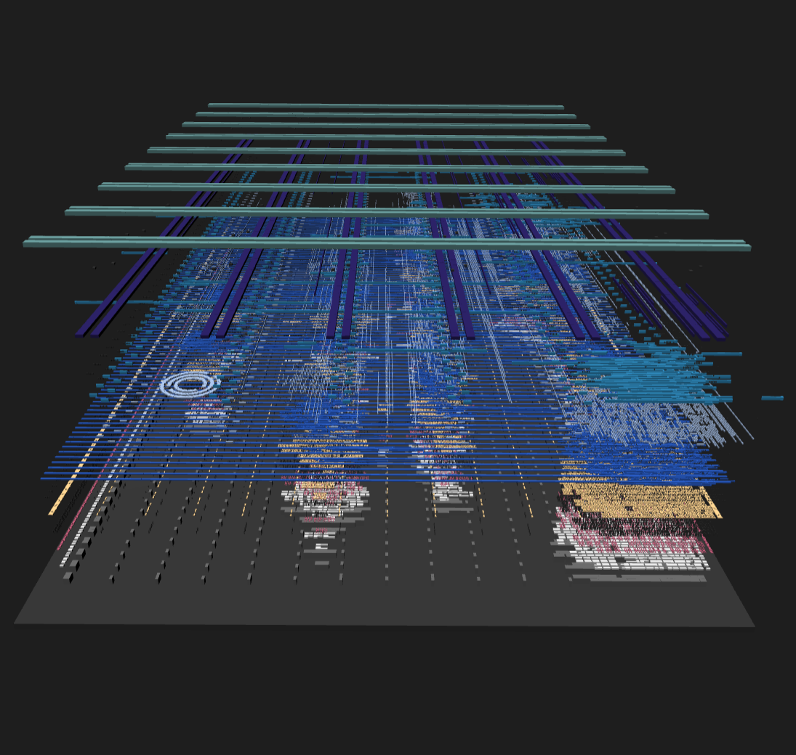
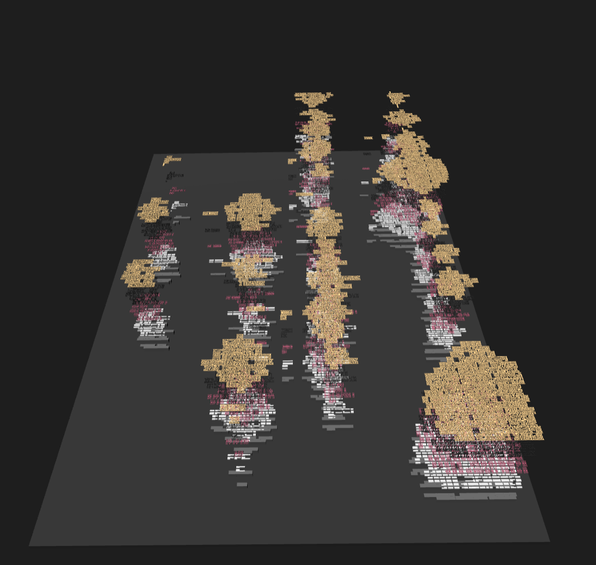

# GDS-to-RTL/

The twenty scripts that turn `puzzle.gds` into an answer.

They run in numerical order. `run.sh` calls them in exactly this sequence, and
the `step` column is the label it prints as it goes. Each one is standalone:
it takes its inputs as arguments and writes to a directory you name, so you can
re-run any single script without touching the others.

## What we are starting from

A GDS file is a pile of polygons on numbered layers. No cell names, no net
names, no hierarchy. Here is the puzzle from above, all layers on at once:

Those ten thick horizontal bands are the power grid, and the vertical stripes
are routing. Underneath all of it are 728 logic cells. Pull the stack apart in
3D and you can see how little of the file is actually logic and how much is
wiring:

Drop everything above local interconnect and the transistors show up on their
own. This is the view the extractor really cares about, because a transistor is
just `poly` crossing `diff`:

Both 3D views are GDS3D. See [`../extra-stuff/tips-and-personal-notes.txt`](../extra-stuff/tips-and-personal-notes.txt)
for how it was set up.

## The scripts

| # | script | step | reads | writes | what it does |
|---|---|---|---|---|---|
| 01 | `01_gds_inventory.py` | W1, P1 | a `.gds` | `instances.csv`, `labels.csv` | Bill of materials. Every placement (cell type, x, y, orientation) and every text label that survived. Answers "what is in here" before any connectivity exists. |
| 02 | `02_extract_netlist.py` | W2, P2 | a `.gds`, `pdk/*.lef` | `extracted_netlist.v`, `extracted.json` | **The extractor.** Polygons, then per-layer islands, then union-find through the vias, then nets, then Verilog. This is the step that turns a picture into a circuit. |
| 03 | `03_def_crosscheck.py` | W3 | GDS + golden DEF + golden netlist | `name_map.json` | Warm-up only. Proves the extractor is exactly right by matching placements to DEF components and comparing connectivity pin by pin. |
| 04 | `04_gen_models.py` | W4, P3 | `pdk/*.lib` | `*_models.v` | Liberty `function:` strings into simulatable Verilog cell models. The truth tables come from the PDK, so they cannot be got wrong by hand. |
| 05 | `05_resynth.ys` | W7 | `warmup-task/00_source.v` | `resynth_netlist.v` | The forward flow, for contrast: yosys `synth`, `dfflibmap`, `abc`. Shows what the reverse direction is undoing. |
| 06 | `06_vcd_replay.py` | P4 | a `.vcd`, top name | `tb_replay.v` | Turns a recorded waveform into a self-checking testbench. This is how the puzzle netlist gets validated against real silicon. |
| 07 | `07_structure.py` | P5 | netlist | `structure.{txt,json}` | Register graph plus Tarjan SCC. Recovers the counters and FSMs that synthesis flattened away. |
| 08 | `08_decompile.py` | P6 | netlist, `pdk/*.lib` | stdout | Gate cone into a boolean expression, stopping at flop outputs and ports. Takes `--flop <name>` or `--all-flops`. |
| 09 | `09_slots.py` | P7 | netlist, lib, `structure.json` | `slots.{txt,json}` | Which scan-counter value gates each flop pair. Separates the 11 gated on a column index from the 11 gated on something else. |
| 10 | `10_uniqueness.py` | P8 | netlist, models | `uniqueness.json` | Falsification harness. Generates grids that satisfy a hypothesis, then asks the netlist whether it accepts them. |
| 11 | `11_probe_cells.py` | P9 | netlist, models, `structure.json` | `regions.{txt,json}` | **The breakthrough.** 121 single-cell trials: drive `I=1` at exactly one grid position, see which counters increment. Reads the region map straight out of the silicon. |
| 12 | `12_misc_probe.py` | P10 | netlist, models | `misc_probe.log` | Star-count sweep, which identifies the 8-flop total register, plus the full message catalogue recovered by deliberately failing. |
| 13 | `13_starbattle.py` | P12 | `regions.json` | stdout | Independent z3 solve of the recovered constraints, and a full enumeration to prove the solution is unique. |
| 14 | `14_gen_rtl.py` | P13 | `regions.json`, bits | `puzzle_recovered.v`, `tb_equiv.v` | Emits behavioural RTL for the design as understood, plus a 540-grid equivalence testbench against the extracted gates. |
| 15 | `15_dump_output.py` | P14 | netlist, models, bits | `dump.log`, `message.txt`, `dump.vcd` | Raw per-cycle `O[7:0]`, protocol-agnostic, then ASCII-decodes the verdict. |
| 16 | `16_make_vcd.py` | P15 | netlist, models, bits | `success_inputs.vcd` | Generates the winning waveform, shaped to match `example_inputs.vcd` exactly so the two can be diffed in Surfer. |
| 17 | `17_write_answer.py` | P16 | `regions.json`, bits | `solution_grid.txt`, `input_sequence.txt` | Renders the human-readable answer. |
| 18 | `18_easter_eggs.py` | E1 | a `.gds`, optional reference `.gds` | `easter_eggs.txt` | Diffs the layer set against the warm-up and splits hand-added layers from cell-library differences, rasterises any dense block of tiny top-level polygons (that is how the logo turns up), then Morse-decodes the bar strip. |
| 19 | `19_floorplan.py` | E2 | `.gds`, `regions.json` | `floorplan.txt` | Puts the recovered logical blocks back on the die. The physical hint, measured rather than eyeballed. |
| 20 | `20_vcd_message.py` | E3 | `example_inputs.vcd` | `vcd_message.txt` | Reports the `$date` and `$version` header fields, then decodes the hidden ASCII in the *inputs* of the supplied waveform (11 rows, 7 bits per frame). |
| . | `tb_warmup.v` | W5 | . | `warmup.vcd` | Warm-up equivalence and function testbench. Golden against extracted, 3000 random cycles. |

Two steps have no script of their own. **W6** and **P11** are a single inline
`yosys ... sat` invocation that `run.sh` prints in full. Steps W5, P4 and P13
generate a testbench with the script above and then shell out to
`iverilog` and `vvp`.

## Conventions

* Paths are always explicit arguments. The only default anywhere is
  `02_extract_netlist.py` reaching for `<script_dir>/../pdk/sky130_fd_sc_hd_merged.lef`,
  and `LEF=` overrides it.
* `02_extract_netlist.py` also takes `GAP=` (island stitch threshold, default
  0.06 um) and `PROBE=netA,netB` (report the nearest foreign island per layer
  with bounding boxes, so you can jump to that coordinate in KLayout).
* Anything that simulates shells out to `iverilog` and `vvp`. Anything formal
  shells out to `yosys`. No script needs a GUI.

See [`../RUN.md`](../RUN.md) for install, running, and what lands where.
