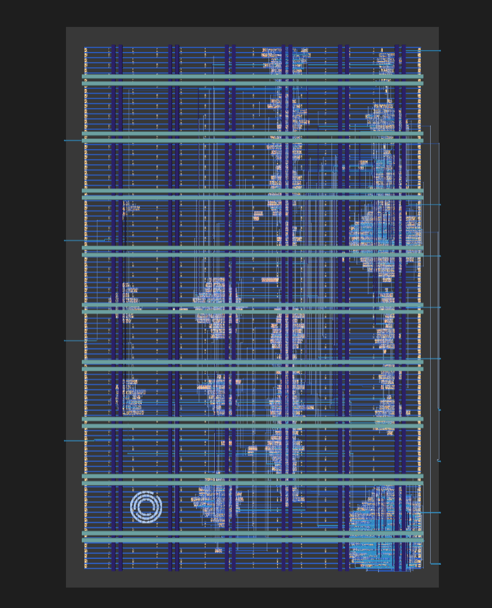

# GDS to RTL

Reverse-engineering the [Jane Street ASIC puzzle](https://blog.janestreet.com/can-you-reverse-engineer-an-asic/):
recovering a circuit from a layout file, working out what it checks, and then
solving it.

    I dearly thank authors of "ReGDS: A Reverse Engineering Framework from GDSII to Gate-level Netlist" (https://ieeexplore.ieee.org/document/9300272/)!

## Team

Amruth Ayaan Gulawani 

## Timeline

| Event | Action |
|---|---|
| Puzzle Announcement (Aug 6) | spent reading the blog and puzzle repo |
| Warmup Task (Aug 7-9) | spent performing the downstream run from provided RTL till GDS (OpenROAD) to understand downstream information gain/loss |
| Warmup Reverse Engineering (Aug 8-9) | Crafted the pipeline for netlist recovery |
| Main Puzzle (Aug 10) | Recovered the netlist and the circuit, and the correct puzzle solution |
| Submission (Aug 12) | Submitted the solution |

## What we had

One GDS file. Polygons on numbered layers, with the cell names, net names and
hierarchy stripped out. A sample waveform where the chip says no. A hint image.
That is it.



## What we did

Extracted a netlist from the raw geometry, proved the extractor exact against
the warm-up's golden files, then validated it against the real chip's recorded
outputs. Recovered the register structure, read the design's hidden data out of
the silicon by probing it 121 times, solved the resulting puzzle two independent
ways, and proved a behavioural model cycle-equivalent to the gates.

## What it turned out to be

An 11x11 Star Battle. Two stars per row, per column and per region, no two
touching. Exactly one grid works. Drive it in and the chip prints:

```
(* TWO STARS *)
```

![Surfer showing success high and O[7:0] spelling the verdict](Images/success-waveform.png)

## "Hey How did you figure out that you needed to switch to ASCII to see the message?"

Funny story while I was on the blog screen, my eyes fell on : 


## Go here to read more

| you want | go here |
|---|---|
| The story of how it was worked out, start to finish | [`WRITEUP.md`](WRITEUP.md) |
| Just the answer | [`solution/`](solution/) |
| To run the whole thing yourself | [`RUN.md`](RUN.md) |
| What each of the 20 scripts does | [`GDS-to-RTL/README.md`](GDS-to-RTL/README.md) |
| The puzzle, the answer and the recovery outputs | [`puzzle-task/README.md`](puzzle-task/README.md) |
| The warm-up, and the full teardown of it | [`warmup-task/README.md`](warmup-task/README.md) |
| All eight easter eggs, and how each turned up | [`Easter-Eggs/README.md`](Easter-Eggs/README.md) |
| To play the puzzle yourself | [`TwoNotTouch-Interactive-Puzzle/README.md`](TwoNotTouch-Interactive-Puzzle/README.md) |
| Viewer setup, tooling notes, dead ends | [`extra-stuff/tips-and-personal-notes.txt`](extra-stuff/tips-and-personal-notes.txt) |
| Jane Street's original brief | [`Challenge-README.md`](Challenge-README.md) |

## Quick start

```bash
python3 -m venv .venv
.venv/bin/pip install -r requirements.txt
bash run.sh
```

Needs `yosys`, `iverilog` and `python3-tk` from your package manager. About four
minutes end to end. Full detail, including what each of the fourteen checkpoints
should print, is in [`RUN.md`](RUN.md).

## Layout

| directory | what is in it |
|---|---|
| `solution/` | The seven deliverables. The answer, the grid, how to drive the chip, the recovered RTL. |
| `GDS-to-RTL/` | The 20 pipeline scripts, numbered in run order. |
| `puzzle-task/` | `puzzle.gds` as supplied, plus everything recovered from it. |
| `warmup-task/` | The practice design and its golden files, plus the teardown. |
| `Easter-Eggs/` | The eight things hidden in the chip and the repo. |
| `TwoNotTouch-Interactive-Puzzle/` | A tkinter board so you can play it by hand. |
| `pdk/` | The sky130 Liberty and merged LEF the extractor reads. |
| `Images/` | Screenshots used by the READMEs. |
| `extra-stuff/` | Working notes and a full run log. |

`run.sh` also writes `results/`, which is 7 MB of intermediates and is
gitignored. Every file in it is filed permanently under `puzzle-task/` and
`warmup-task/`, so nothing is lost by not committing it.
