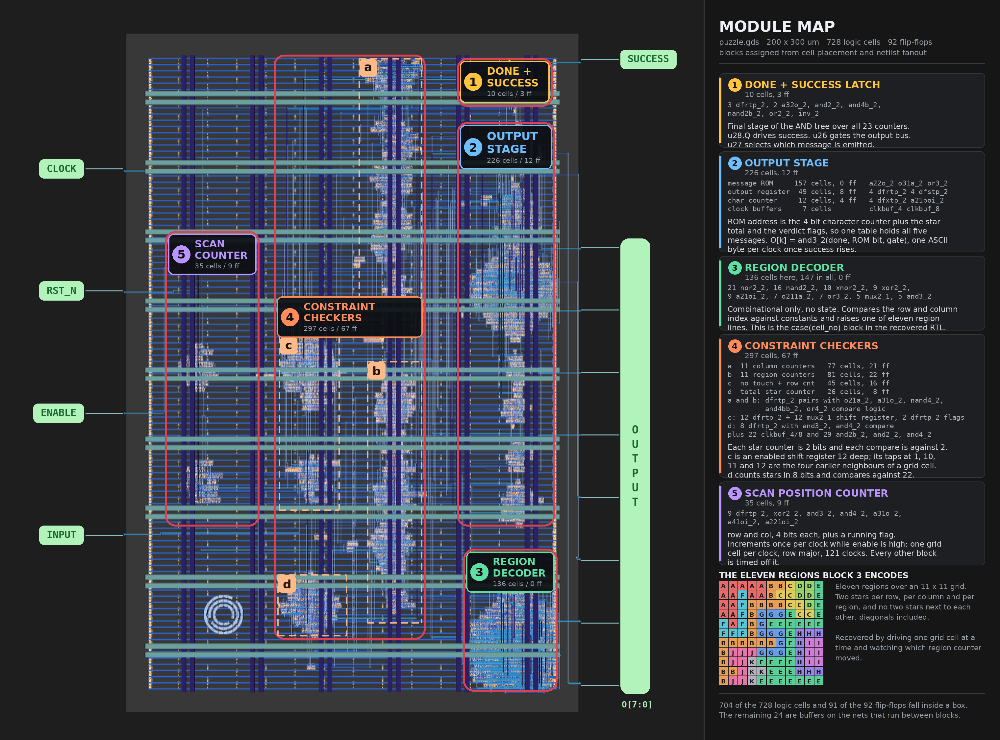
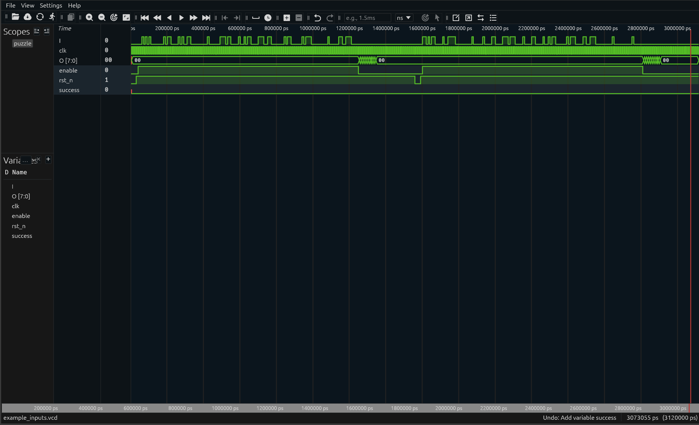
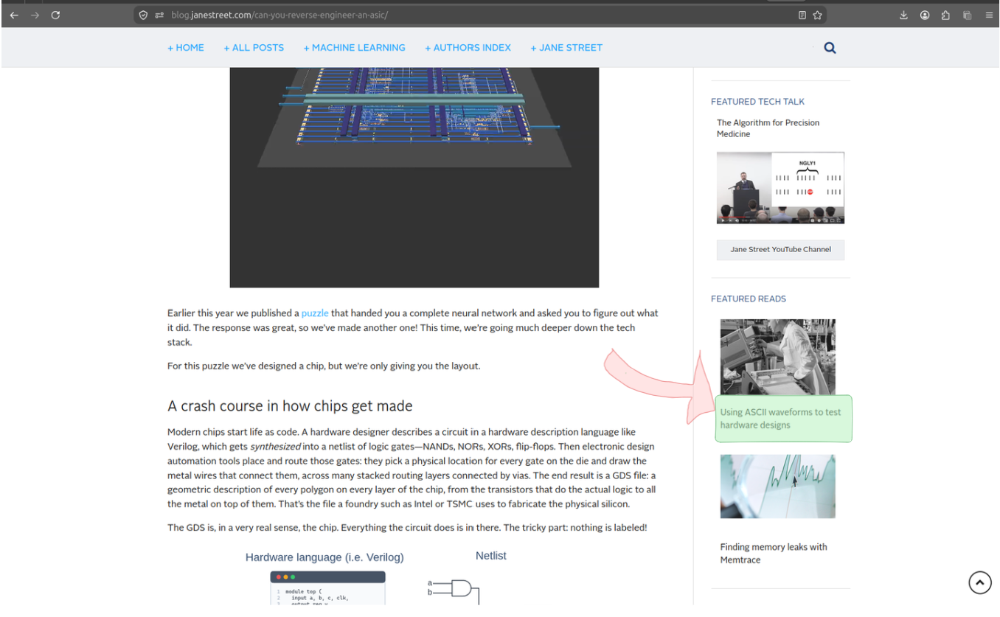
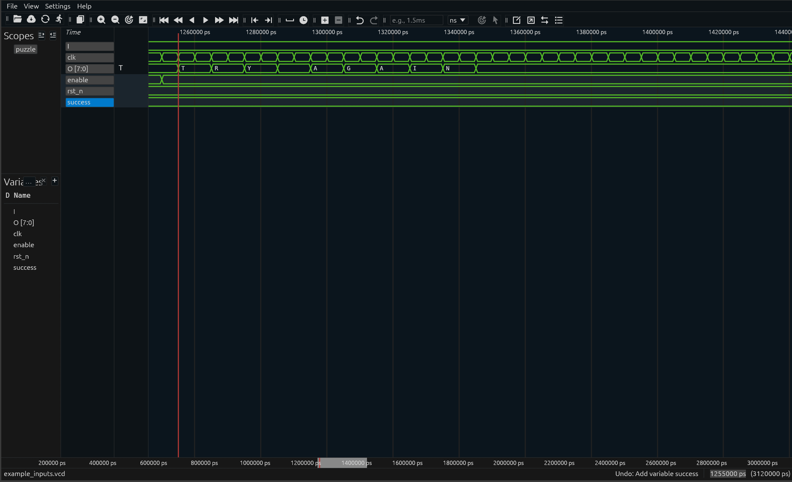

# ASIC Reverse-Engineering Puzzle 2026 

This repository contains my solution at solving [ASIC Reverse-Engineering Puzzle 2026](https://blog.janestreet.com/can-you-reverse-engineer-an-asic/) hosted by Jane Street. 

I decided to call my submission "GDS-to-RTL", contrary to "RTL-to-GDS" :)

The "ASIC Reverse-engineering" involves recovering a circuit from a layout file, working out what the circuit perorms, and then solving it.

Check out [ReGDS: A Reverse Engineering Framework from GDSII to Gate-level Netlist](https://ieeexplore.ieee.org/document/9300272/), was a good starting point to get a glimpse of the netlist recovery procedure.

----

## Summary of Results

Below table lists all final deliverable files / outputs for the Puzzle :  

| Task | Output |
|---|---|
| String value recovered from the chip after driving in a valid input sequence | `(* TWO STARS *)` (see [13_output_string.txt](puzzle-solution/13_output_string.txt)) |
| Valid input sequence | 121 bits, row-major (see [12_input_sequence.txt](puzzle-solution/12_input_sequence.txt)) |
| The puzzle's region map, the unique solution grid | (see [11_solution_grid.txt](puzzle-solution/11_solution_grid.txt)) |
| The recovered behavioural RTL for the whole design | (see [08_recovered_rtl.v](puzzle-solution/08_recovered_rtl.v)) |
| The gate netlist recovered from the layout | 728 cells, 738 nets (see [02_extracted_netlist.v](puzzle-solution/02_extracted_netlist.v)) |
| The waveform with `success` actually high | (see [14_success_inputs.vcd](puzzle-solution/14_success_inputs.vcd)) |

### What the circuit is

The chip is an **11 x 11 Star Battle validator**, the puzzle also known as Two
Not Touch. A 121-bit grid is shifted in serially on `I`, one cell per rising clock
while `enable` is high, row-major. On the following edge it raises `success` if
the grid places exactly two stars in every row, every column and every one of
eleven irregular regions, 22 stars in total, with no two stars adjacent,
diagonals included. It then streams an ASCII verdict out of `O[7:0]`, one
character per clock.

The recovered RTL in
[`08_recovered_rtl.v`](puzzle-solution/08_recovered_rtl.v) is one flat module,
because that is what the netlist is: synthesis flattened the hierarchy and the
layout keeps no record of it. Written as a hierarchy, the same 728 cells are the
blocks below, and each one occupies a contiguous region of the die.

| block | what it would be in RTL | cells | flops |
|---|---|---|---|
| scan position counter | two 4-bit up counters, `row` and `col`, plus a `running` flag | 32 | 9 |
| region decoder | combinational lookup, cell index to one of eleven region ids | 147 | 0 |
| column star counters | 11 x 2-bit saturating counter with an equality compare against 2 | 81 | 22 |
| region star counters | 11 x the same counter, selected by the region decoder | 81 | 22 |
| row star counter and no-touch checker | one shared 2-bit counter cleared per row, plus a 12-deep shift register of `I` tapped at 1, 10, 11 and 12, feeding two violation flags | 45 | 16 |
| total star counter | 8-bit accumulator with an equality compare against 22 | 27 | 8 |
| success logic | a 23-input AND tree over every counter and the latch that holds `success` | 53 | 3 |
| output stage | a 4-bit character counter, a verdict lookup table and an 8-bit output register | 225 | 12 |
| clock tree | `clkbuf_4`, `clkbuf_8`, `clkbuf_16` | 33 | 0 |

That is 724 of the 728 cells and all 92 flops. The remaining 4 are buffers that
drive more than one block.

There is no adder here in the arithmetic sense. Every count is small, so the
design uses 2-bit saturating counters and equality compares rather than an adder
and a magnitude comparator. The warm-up is the design with the adder: two 8-bit
shift registers, an 8-bit adder and a comparator against 496.

Where each block physically sits on the die, with the counts for each drawn box:




----

## Summary of all Easter Eggs found

Nine of them, in the order I found them. Each has its own file with what it is,
where it was, how I found it and when.

| # | Easter Egg | Where it was | Write-up |
|---|---|---|---|
| 1 | The **Jane Street logo**, etched in metal 2. 1,366 floating polygons in a 17.1 um square | [puzzle.gds](puzzle/puzzle.gds), and the warm-up GDS too | [01](Easter-Eggs/01_easter_egg.txt) |
| 2 | **"PER ARENAM AD ASTRA"** in Morse code, Latin for "through the sand, to the stars". 36 bars on a layer that is not a sky130 mask layer, below the die | [puzzle.gds](puzzle/puzzle.gds), layer 200/0 at y = -52.72 um | [02](Easter-Eggs/02_easter_egg.txt) |
| 3 | **"Leave no stone unturned!"**, a note left for a human where a simulator would write its own name | [example_inputs.vcd](puzzle/example_inputs.vcd), the `$version` field | [03](Easter-Eggs/03_easter_egg.txt) |
| 4 | **"Sat Dec 31 23:59:60 2016"**, a real leap second and the most recent one ever inserted into UTC | [example_inputs.vcd](puzzle/example_inputs.vcd), the `$date` field | [04](Easter-Eggs/04_easter_egg.txt) |
| 5 | **Read the waveform as ASCII.** The instruction that unlocks the whole output side, hidden in plain sight as a passing link | the [puzzle blog post](https://blog.janestreet.com/can-you-reverse-engineer-an-asic/) | [05](Easter-Eggs/05_easter_egg.txt) |
| 6 | **"The night sky awaits"**, in the *inputs*. 11 rows of 7 bits, because standard ASCII needs 7 | [example_inputs.vcd](puzzle/example_inputs.vcd), the `I` input, both frames | [06](Easter-Eggs/06_easter_egg.txt) |
| 7 | **496 is the third perfect number**, `1+2+4+8+16+31+62+124+248`, and `A+B=496` has exactly 15 eight-bit solutions | [warmup/00_source.v](warmup/00_source.v) | [07](Easter-Eggs/07_easter_egg.txt) |
| 8 | **11 + 11 + 1 drawn on the die.** Every counter in one narrow vertical column, in two stacks of eleven plus a loner | [puzzle.gds](puzzle/puzzle.gds), flip-flop placement at x 114.8 to 126.3 | [08](Easter-Eggs/08_easter_egg.txt) |
| 9 | **Five messages, not four.** `EMPTY SKY`, `BIG BANG`, `TRY AGAIN`, **`TWO NOT TOUCH`** and `(* TWO STARS *)`, the last two being the puzzle's own name and its rule in OCaml comment syntax | the output ROM (see [10_message_catalogue.txt](puzzle-solution/10_message_catalogue.txt)) | [09](Easter-Eggs/09_easter_egg.txt) |

`TWO NOT TOUCH` is the least reachable of the five. The chip prints it only for
a grid that gets every count right, two stars in every row, every column and
every region, and then breaks exactly one rule: two stars touch. So it names the
rule that was broken, and that rule is the other name of the puzzle. No random
sweep reaches it. I found it by asking a SAT solver to enumerate every string the
output bus can produce, over the fourteen queries that closed the list.

#### Note : 

A perfect number is a positive whole number that equals the sum of its positive proper divisors, leaving out the number itself;

    496 (1 + 2 + 4 + 8 + 16 + 31 + 62 + 124 + 248)

#### Note : 

A total of 9 Easter Eggs = number of positive proper divisors of 496 (PLEASE TAKE THIS AS A JOKE)
    
----

## Documentation (20-25 min read)

I have documented my entire solution's implementation is this single readme file, below table is a glimpse of what follows;

#### Sections (I) through (VII) discuss the core findings (5 min read)

#### Sections (VIII) discusses the complete implementation details (15 min read) 

| Title | What it is about |
|---|---|
| (I) What were the files provided for the puzzle | You can have a look into the puzzle's provided input files |
| (II) The first breakthrough moment  | Discusses my first breakthrough while inspecting the puzzle's waveform file |
| (III) What I did  | A summary of what I did |
| (IV) What the puzzle turned out to be  | A summary of what the solution of this puzzle is |
| (V) Success Waveform  | The puzzle's main solution/deliverable component |
| (VI) How to run | Quick start / Installations |
| (VII) Directory Layout  | Solution's File layout |
| (VIII) Full Picture  | Complete breakdown of the solution |

----

## (I) What were the files provided for the puzzle

The puzzle provided the two sets of files : 

#### Set I (Main Puzzle) 

| File | What it is about | 
|---|---|
| [GDS file](https://github.com/janestreet/asic-puzzle-2026/blob/master/puzzle.gds) (1.4MB) | contains metal, routing, and active transistor layers, with the cell names, net names and hierarchy stripped out |
| [Layout image](https://github.com/janestreet/asic-puzzle-2026/blob/master/layout.png) (136KB)| an image of the GDS file with the I/O's labelled for reference |
| [Example Inputs VCD](https://github.com/janestreet/asic-puzzle-2026/blob/master/example_inputs.vcd) (8.4KB)|  driven by incorrect inputs, with a "success" flag that stays low (we need to drive it high, after providing the circuit with correct inputs). |

#### Set II (Warmup) 

| File | What it is about | 
|---|---|
| [RTL source file](warmup/00_source.v) (1.2KB) | The original Verilog source code of the example design |
| [Netlist file](warmup/01_netlist.v) (19KB)| Synthesized netlist comprising of a list of standard cells and connections |
| [Netlist file (with power rails)](warmup/02_netlist_with_power_rails.v) (30KB)| Netlist with VDD and GND rails added |
| [post_pnr DEF file](warmup/03_post_place_and_route.def) (112KB) | Physical layout of cells and routing connections, corresponding to cell and net names. |
|[GDS file](warmup/04_final.gds) (306KB)| The final manufacturable layout file, with many internal names removed |

The warmup puzzle is a small example design and was run through the same RTL to GDS flow, to obtain the GDS file (similar to main puzzle GDS). The example design consists of two shift registers, an adder, and a comparator, outputting success if A + B == 496.

The whole flow was carried out using SkyWater's 130 nm PDK, see [more](https://skywater-pdk.readthedocs.io/en/main/).

-----

#### Note : The Layout image provided reveals the following I/O,

| I/O | What it is about | 
|---|---|
| clk (input) | drives all sequential elements (d-flop based counters) |
| rst_n (input) | active low resets to all sequential elements |
| enable (input) | active high enable to all sequential elements |
| I (input) | serial 1 bit input wire (we drive the puzzle cells serially through this) |
| O[7:0] (output) | 8 bit output vector displaying status of puzzle's state |
| success (output) | driven high when a valid/solved puzzle was driven in |

----

##### Note : 

I ran the three puzzle files through exiftool for a preliminary check and found nothing interesting.

I ran the warmup files and you will notice the file size going from 

- 1.2 KB (00_source.v) 
- 19 KB (01_netlist.v) 
- 30 KB (02_netlist_with_power_rails.v)
- 112 KB (03_post_place_and_route.def)
- 306KB (04_final.gds). 


-----

Here's how the waveform (of the provided VCD file) looks like : 

You will notice the "success" flag remains low throughout.



----

## (II) My first breakthrough moment 

Switching to ASCII (I rarely use ASCII and prefer staying in Decimal/Hexadecimal/unsigned Integer) was the first breakthrough, I was on the [blog site](https://blog.janestreet.com/can-you-reverse-engineer-an-asic/), and my eyes fell on : 



----

It was at this point while viewing the waveform when I decided to switch to viewing the VCD file in ASCII.

Which revealed the following message "TRY AGAIN" (at 1255000 ps marker): 




----

## (III) What I did

- Extracted a netlist from the raw geometry present in the puzzle GDS file.
- Proved the extractor pipeline exact against the warm-up's golden files, then validated it against the real chip's recorded outputs. 
- Recovered the register structure, read the design's hidden data out of the silicon by probing it 121 times, solved the resulting puzzle two independent
ways, and proved a behavioural model cycle-equivalent to the gates.

----

## (IV) What the puzzle turned out to be

- An "11x11 Star Battle (Two Not Touch) Validator". Two stars per row, per column and per region, no two
touching. Exactly one grid works. Drive in a solved 11x11 Two Not Touch Puzzle grid serially and the chip prints:

```
(* TWO STARS *)
```

## (V) Success Waveform 

It was found that to drive "success" flag high, the following input sequence was needed : 

    0000000101010000100000000000010101010000000000001010000001000001000000100000101000010000000100000010000010010001010000000

![Surfer showing success high and O[7:0] spelling the verdict](Images/success-waveform.png)


##### Note :

Star Battle is also referred to as Two Not Touch

- One can read about how the puzzle works [here](https://krazydad.com/twonottouch/intro_tutorial/)

##### Want to try the puzzle from this challenge? 

- See [here](TwoNotTouch-Interactive-Puzzle/)


##### Want to try the puzzle?

- Check out this sample [interactive Two Not Touch Puzzle](https://krazydad.com/play/starbattle/?kind=10x10&volumeNumber=2&bookNumber=1&puzzleNumber=24)

----

## (VI) How to run 

The whole flow is one Python file. The table below is everything it needs, plus
the tools I used by hand to look at things.

| Name | Type | Why it was used |
|---|---|---|
| **gdstk** | Python package | GDSII parsing and hierarchy flattening: the front end of the extractor |
| **shapely** | Python package | Polygon union and STRtree spatial indexing: the core of net extraction. **Requires 2.0 or newer.** 1.x has no `predicate=` keyword and returns geometries instead of integer indices, which silently builds the wrong netlist |
| **python-sat** | Python package | Bundles CaDiCaL. Solves the unrolled gate netlist: the 121-bit key, the minimum-depth bound, the uniqueness proof, and the enumeration of every string the output ROM holds |
| **z3-solver** | Python package | The independent constraint solve of the recovered puzzle, and generating the grid classes used to falsify hypotheses and to stress the equivalence run |
| **iverilog + vvp** | CLI tool | Used exactly twice, as an independent second opinion: golden versus extracted on the warm-up, and gates versus recovered RTL on the puzzle |
| **KLayout** | GUI tool | Layout viewer, for spot-checking a coordinate |
| **Surfer** | GUI tool | Waveform viewer. Switching a bus to ASCII is a right click, which is what easter egg 5 needs |
| **GDS3D** | GUI tool | 3D rendering of the layer stack, separating power grid from routing and isolating poly over diffusion to see the transistors. Where I found the logo |
| **Tiny Tapeout GDS Viewer** | Web tool | Zero-install browser view of the layout for a first look |
| **sky130_fd_sc_hd Liberty (`.lib`)** | PDK data | Cell pin directions, the boolean `function` of every combinational output, and the `ff` group of every flop. Every truth table in this flow comes from here, none are hand written |
| **sky130_fd_sc_hd merged LEF** | PDK data | The complete pin landing geometry, `PIN / PORT / RECT`. Reading pins from GDS text labels instead loses every pin rectangle the label does not tag |
| **collections, json, math, os, re, subprocess, sys** | Stdlib | Grouping and counting, interchange, coordinate arithmetic, Liberty and Verilog parsing, and shelling out to iverilog |

**yosys is no longer used at all.** The earlier version of this pipeline used it
for bounded model checking, at roughly 40 seconds per depth and with no way to
ask for uniqueness. The Tseitin encoder in `GDS-to-RTL/gds_to_rtl.py` answers the
same questions on the same netlist in under half a second, and answers the
uniqueness question too, so yosys came out. **OpenROAD is not needed either**; I
ran it on the warm-up source early on, to see how much information the forward
flow removes before trying to reverse it.

### Complete Installation (Ubuntu/Debian)
    
    git clone https://github.com/NotCleo/GDS-to-RTL.git
    cd GDS-to-RTL
    sudo apt install iverilog python3-tk tree -y
    bash RUN.sh

`RUN.sh` creates `.venv` and installs `requirements.txt` on first run, so that is
the whole install. It takes about 15 seconds end to end and rebuilds
`warmup-solution/` and `puzzle-solution/` from scratch every time.

    bash RUN.sh --only warmup     just the warm-up, which validates the toolchain
    bash RUN.sh --only puzzle     just the puzzle
    bash RUN.sh --no-iverilog     skip the two independent-simulator checks

#### To view the results

    tree puzzle-solution warmup-solution

Every file in those two directories is listed and explained at the end of
section (VIII).

#### Optional, only if you want to look at the waveforms by hand

    mkdir -p ~/surfer_install && cd ~/surfer_install
    wget "https://gitlab.com/api/v4/projects/42073614/jobs/artifacts/main/raw/surfer_linux.zip?job=linux_build" -O surfer_linux.zip
    unzip surfer_linux.zip
    chmod +x surfer
    mkdir -p ~/.local/bin
    mv surfer ~/.local/bin/
    export PATH="$HOME/.local/bin:$PATH"
    surfer puzzle-solution/14_success_inputs.vcd

Open `O[7:0]` and set its format to ASCII. That is easter egg 5: the byte stream
is text.

#### Note

`python3-tk` is only needed for the interactive board in
[`TwoNotTouch-Interactive-Puzzle/`](TwoNotTouch-Interactive-Puzzle/). The
pipeline itself is entirely headless.

The captured output of a full run is in [`RUN.log`](RUN.log), the pipeline's own
stage-by-stage log is in [`GDS-to-RTL/run.log`](GDS-to-RTL/run.log), and every stage
is described with its numbers in [`GDS-to-RTL/summary.md`](GDS-to-RTL/summary.md).

----

## (VII) Layout

```
├── CHALLENGE.md         # The main challenge 
├── RUN.log              # The complete run log
├── RUN.sh               # Main Orchestrating bash
├── README.md            # This file
├── requirements.txt     # Python dependencies 
├── GDS-to-RTL           # Reverse Recovery scripts
├── puzzle               # Provided Puzzle files
├── warmup               # Provided warmup files
├── puzzle-solution      # Puzzle solution files
├── warmup-solution      # warmup solution files
├── TwoNotTouch-Interactive-Puzzle    # Interactive Two Not Touch Puzzle (TRY THIS!)
├── Easter-Eggs          # List of easter eggs
├── Images               # Images of waveforms, layouts, schematics
├── pdk                  # SKY130 PDK
└── Personal-Notes       # Ignore this
```

----

## (VIII) Full Picture 

Everything below is what actually happened, in the order it happened. Every
number in it is printed by `GDS-to-RTL/gds_to_rtl.py` on a fresh run, and the run
that produced these numbers is in [`RUN.log`](RUN.log).

| | |
|---|---|
| The whole flow | one file, [`GDS-to-RTL/gds_to_rtl.py`](GDS-to-RTL/gds_to_rtl.py), 2,715 lines |
| Runtime | about 15 seconds |
| Stage by stage | [`GDS-to-RTL/summary.md`](GDS-to-RTL/summary.md) |
| Full terminal log | [`GDS-to-RTL/run.log`](GDS-to-RTL/run.log) |

----

- I started with the puzzle.gds file provided, first question, What does a GDS actually contain?
- A GDS is a geometry file. 
- It stores polygons, each tagged with a layer number and a datatype, plus a hierarchy of cells that can be instantiated at a position with a rotation and an optional mirror.
- There is no concept of a wire, a gate, a pin, or a connection. 
- Two pieces of metal are connected if and only if they physically overlap, and the file does not say so anywhere. 
- You have to work it out from the coordinates.
- The standard cells were still named, which is the one significant break I got. 
- "sky130_fd_sc_hd__nand3_2" tells me what a cell does. 
- What was stripped is everything above that: which instance is which, what the nets are called, and how the design was organised.
- Following my instinct to open it in a viewer and stare. I tried the TinyTapeout online viewer, then switched to GDS3D because I wanted to magnify specific sections and the browser viewer fought me. Staring taught me almost nothing.
- Suppose I did write a netlist extractor (because that was the first thing this challenge requires), and point it at puzzle.gds, and it produces a netlist. How do I know that netlist is right?
- Fortunately, we have the warmup, either I build the netlist extractor against my puzzle gds and then use the warmup files to golden reference it or the other way round, this table below was what I decided to follow

| stage | what it buys me |
|---|---|
| Build the extractor against the warm-up | I can compare to the golden netlist exactly, net by net |
| Only then point it at the puzzle | Any disagreement later is about the puzzle, not about my tools |

- Before any connectivity work, I just took inventory: what cells are placed, where, in what orientation, and every text label that survived.
- The warm-up came out at 230 standard cell instances, of which 79 are logic and the rest are well taps and decoupling capacitors. Two shift registers, an adder, a comparator, three clock buffers.
- Now that I knew how to take inventory off a gds file, came the next question, what do these discrete std cells connect to perform? for this I came to my netlist extraction stage.
- It would appear next to impossible to take in polygons to output their connectivity, right? but the algorithm is much simpler than I initially thought;

| step | what happens |
|---|---|
| 1 | For each conducting layer, take every polygon and merge overlapping ones into islands. Each island is one contiguous piece of conductor. |
| 2 | Walk the via layers. A via cut that touches island X on the layer below and island Y on the layer above means X and Y are the same electrical node. |
| 3 | Union-find over all of those relationships. Every resulting connected component is a net. |
| 4 | For each placed cell, look up where its pins are, find which net covers each pin, and emit Verilog. |

- Step 1 is a union of overlapping polygons per layer. 
- Step 2 needs a spatial index or it is quadratic and unusable, so it goes through an R-tree. 

#### note :

Shapely 2.0 changed `STRtree.query` to take a `predicate` argument and return integer indices rather than geometries. On Shapely 1.8 the call signature does not exist. So 2.0 is a hard floor.

- Step 3,4 come with an interesting find;

| bug | what I did wrong | why it silently broke things | the fix |
|---|---|---|---|
| Pin geometry | Used the GDS text labels to decide which polygon is which pin | A label tags exactly one polygon. A real pin is often several polygons at different places in the cell. Pins went missing, and nets that should have been joined stayed separate | Read the pin rectangles out of the PDK's LEF. `PIN ... PORT ... RECT` is the authoritative geometry and lists every rectangle belonging to each pin |
| Antenna diodes | Treated `diode_2` as an inert protection device and skipped it | The router uses a diode as a convenient place to jump layers and lands on it twice. Skipping it tears one real net into two halves that never reconnect | Treat it as an electrical bridge: its two connections are the same net |

- The diode one is the sort of thing that only surfaces if you have ground truth.
- The netlist without diodes had the right cell count, no dangling pins and no obvious defect. It just described a different circuit.
- There was another bug; To recover instance names I matched my extracted placements against the DEF, comparing cell type and lower-left corner. I got 0 matches out of 79.
- The cause? I was using the geometric bounding box of each cell, and the nwell implant overhangs the cell outline. So my box was consistently bigger than the
real one, and every corner was wrong by the same small amount. What the DEF records is the abutment box, which sky130 stores as its own layer, 81/4. Reading
that instead gave 79 out of 79 immediately.
- Now came the time for proving the extractor is exact or not, I based it off 4 checks;

| check | what it proves | result |
|---|---|---|
| Every net has exactly one driver | No shorts, no floating outputs, no gate driving into another gate's output | 84 nets, 0 violations |
| Every GDS placement matches a DEF component | Same cell, same corner, same orientation | 79 of 79 |
| Net partition matches the golden netlist | The two circuits are literally the same circuit | 84 exact matches, 0 mismatches |
| Simulate both netlists side by side for 3000 cycles | They behave identically | All checks passed |

- Seeing the third check pass helped as the two netlists (golden and extracted) are identical if and only if they split the same set of pins into the same groups, with the same ports attached to the same groups.
- At this stage, I could prove exactness while my extracted netlist still called everything u17 and net_412.


### 1. What the layout viewer turned up: easter egg 1

Before any of the extractor work, back when I was still turning layers off one at
a time in GDS3D, one thing did come out of it.

On met2 there is a pale ring low on the die that does not look like anything else
in the file. Routing on a metal layer is long power straps and short jogs between
vias, and this was neither: 1,366 sub-micron polygons crammed into a 17.10 x
17.10 um block, sitting over a piece of die with nothing under it, connected to
nothing at all. It is the Jane Street logo, drawn in real mask geometry. It is in
the warm-up GDS too, at a different corner. Details and the rasterised version:
[`Easter-Eggs/01_easter_egg.txt`](Easter-Eggs/01_easter_egg.txt).

That is everything the viewer produced. Everything after this is computed.

----

### 2. Easter egg 7, and solving the warm-up without reading its answer

**Easter egg 7** is sitting in the very first file I opened. The warm-up raises
`success` when `A + B == 496`, and 496 is not an arbitrary constant. It is the
third perfect number, equal to the sum of its own proper divisors:

```
496 = 1 + 2 + 4 + 8 + 16 + 31 + 62 + 124 + 248
```

It is also `2^4 x (2^5 - 1) = 16 x 31`, the Euclid form. And it is a well chosen
constant for an 8-bit adder: `A` and `B` are eight bits each, so `A + B` ranges
over 0 to 510, and `A + B = 496` has exactly **15** solutions, `A` from 241 to
255, out of 65,536 input pairs.

Which raises the better question. I had just proved my extracted netlist was the
same circuit as the golden one. Could I work out what it *does* without reading
`00_source.v` at all? So instead of reading the answer, I unrolled the extracted
gates over time and asked a SAT solver one question: is there an input sequence
that drives `S` high, and what is the shortest one?

```
K =  6 edges   UNSAT
K =  7 edges   UNSAT
K =  8 edges   SAT
A = 11110010 = 242
B = 11111110 = 254
A + B = 496
```

No gate was traced by hand. The same technique is what the puzzle later turns
on, and running it here first, on a design whose answer can be checked
afterwards, is what validated it. Because there are 15 valid answers, the solver
returning 242 and 254 rather than another pair is expected.
Output: [`warmup-solution/06_sat_solve.txt`](warmup-solution/06_sat_solve.txt).

----

### 3. The puzzle inventory, and easter egg 2

Same extractor, no changes, pointed at `puzzle.gds`. The inventory stage runs
first: every placement, every surviving label, every layer, nothing interpreted.
Output:
[`puzzle-solution/01_gds_inventory.txt`](puzzle-solution/01_gds_inventory.txt).

| | puzzle | warm-up |
|---|---|---|
| structures in the file | 81 | 27 |
| bounding box | (0, -52.72) .. (200, 300) um | (0, 0) .. (100, 100) um |
| total placements | 9,875 | 1,099 |
| logic cells | **728** | **79** |
| distinct logic cell types | 66 | 16 |
| flip-flops | **92** | 16 |
| vias | 8,221 | 869 |
| well taps and decaps | 880 | 151 |
| antenna diodes | 10 | 0 |
| structures that are not standard cells | **36** | 0 |
| pin labels inside cell definitions | 876 | 186 |
| top-level text labels | 17 | 10 |

The 230 warm-up instances I quoted earlier are the 79 logic cells plus the 151
taps and decaps; the remaining 869 placements are via structures, which is why
the placement total is 1,099. On the puzzle the same split gives 728 logic cells,
880 taps and decaps that carry no signal and can be dropped, and 10 antenna
diodes that need special handling.

The 17 top-level labels are the ports, and they are the last real names left in
the file:

```
'I'        on layer 70/5 at (  0.30,  79.22)
'clk'      on layer 70/5 at (  0.30, 238.34)
'rst_n'    on layer 70/5 at (  0.30, 185.30)
'enable'   on layer 70/5 at (  0.30, 132.26)
'O[0]'     on layer 70/5 at (199.70, 204.34)   ... through O[7]
'success'  on layer 70/5 at (199.70, 285.94)
```

Inputs down the left edge, outputs down the right, exactly as the hint image
draws them.

**Easter egg 2** came out of this same inventory, from three separate lines of it
all pointing at the same place.

The bounding box came back as `(0.00, -52.72) .. (200.00, 300.00)`. A negative y.
The placement rows of a standard cell design start at y = 0, so something is
drawn 52.72 um below where the chip is.

The placement histogram has a bucket for anything that is neither a standard cell
nor a via, and on the puzzle it was not empty:

```
21 x INTERNAL_3
15 x INTERNAL_7
```

36 placements of two structures with no pins, no transistors, and names no PDK
uses.

And the layer histogram, checked against the sky130 layer map, flagged one layer
the map does not know: **200/0**, carrying two polygons, one inside each of those
two structures. Diffing the puzzle's layer set against the warm-up's narrows it
further, since both went through the same flow. Three layers appear in the puzzle
and not the warm-up, and two are boring: 66/15 and 81/23 live only inside
standard cells, so they are present because the puzzle instantiates `conb_1` and
`diode_2` and the warm-up has neither. Only 200/0 is drawn outside every cell, so
only 200/0 was added by hand.

36 bars, two widths, 1.38 um and 4.14 um, exactly 1:3, all at y = -52.72,
spanning x = 1.33 to 198.67. Dividing the gaps by the narrow width, every gap is
1, 3 or 7:

```
widths : . - - . . . - . . - . - . . - . . - - - . - - . . . - . . . - . - . . -
gaps   : 1 1 1 3 3 1 1 7 1 3 1 1 3 3 1 3 1 3 1 7 1 3 1 1 7 1 3 1 1 3 3 1 1 3 1
```

Short mark, long mark at 3, gap 1 inside a letter, 3 between letters, 7 between
words. That is International Morse timing exactly, and it decodes with no
ambiguity to:

```
PER ARENAM AD ASTRA
```

Latin, roughly "through the sand, to the stars", a play on *per aspera ad
astra*. Full decode:
[`Easter-Eggs/02_easter_egg.txt`](Easter-Eggs/02_easter_egg.txt).

----

### 4. The layer map, the via census, and the extracted netlist

The four-step algorithm above needs one thing before it can run: which GDS layers
are conductors, which are cuts, and which are neither. sky130 answers that.

| layer | GDS | what it is | how the extractor uses it |
|---|---|---|---|
| li1 | 67/20 | local interconnect, inside and between cells | conductor |
| met1 | 68/20 | first routing metal | conductor |
| met2 | 69/20 | second routing metal | conductor |
| met3 | 70/20 | third routing metal, also carries the port labels on 70/5 | conductor |
| met4 | 71/20 | fourth routing metal, power straps | conductor |
| met5 | 72/20 | fifth routing metal, power straps | conductor |
| mcon | 67/44 | cut, li1 to met1 | bridge |
| via | 68/44 | cut, met1 to met2 | bridge |
| via2 | 69/44 | cut, met2 to met3 | bridge |
| via3 | 70/44 | cut, met3 to met4 | bridge |
| via4 | 71/44 | cut, met4 to met5 | bridge |
| nwell, diff, poly, licon1, nsdm, psdm, npc, hvtp | 64, 65, 66, 93, 94, 95, 78 | transistors and implants | ignored, they carry no inter-cell signal |
| areaid.standardc | 81/4 | the real cell abutment box | used to match placements to the DEF |

Same-layer overlap means connected. Different layers mean nothing without a cut
between them. Unioning per layer on the puzzle:

| conductor | shapes in | islands out |
|---|---|---|
| li1 | 10,819 | 5,495 |
| met1 | 12,606 | 3,001 |
| met2 | 8,517 | 2,060 |
| met3 | 2,560 | 811 |
| met4 | 867 | 45 |
| met5 | 162 | 18 |

**Checking the coordinate transforms.** This check needs no golden file, so it
works on the puzzle too. Every via cut has to land on metal on *both* sides. If a
rotation or a mirror were applied wrongly, vias would sit with metal on one side
only:

```
cut mcon   li1  -> met1 : 17188/17188 bridged
cut via    met1 -> met2 :  3779/3779  bridged
cut via2   met2 -> met3 :   951/951   bridged
cut via3   met3 -> met4 :   687/687   bridged
cut via4   met4 -> met5 :   108/108   bridged
```

**22,713 of 22,713** cuts bridged, none floating. The design that came out:

| | |
|---|---|
| logic cells | 728, in 66 types |
| nets | **738** |
| flip-flops | 92, being 84 `dfrtp_2`, 4 `dfstp_2`, 4 `dfxtp_2` |
| nets with a driver count other than one | **0** |
| nets with no driver at all | **0** |
| combinational loops | **0** |
| clock roots | one, `clk` |

Zero shorts, zero floating outputs and zero undriven nets on both designs. That
last row matters because a single unrecovered connection splits one net into two,
and the circuit becomes a different circuit with no error reported anywhere.

The result is a plain structural Verilog netlist,
[`puzzle-solution/02_extracted_netlist.v`](puzzle-solution/02_extracted_netlist.v):

```verilog
// Recovered from puzzle/puzzle.gds by geometry alone.
// No netlist, DEF or source file was read to produce this.
// 728 logic cells, 738 nets, 0 nets with a driver count other than one.
module puzzle_extracted (I, clk, enable, rst_n, success, O);
  input  I;
  ...
  sky130_fd_sc_hd__xor2_2   u12_xor2_2   (.A(net_141), .B(net_171), .X(net_301));
  sky130_fd_sc_hd__a21oi_2  u13_a21oi_2  (.A1(net_361), .A2(net_386), .B1(net_338), .Y(net_391));
  sky130_fd_sc_hd__nand2_2  u14_nand2_2  (.A(net_115), .B(net_675), .Y(net_138));
  sky130_fd_sc_hd__a22o_2   u15_a22o_2   (.A1(net_317), .A2(net_677), .B1(net_172), .B2(net_334), .X(net_197));
  ...
  sky130_fd_sc_hd__and3_2   u23_and3_2   (.A(net_368), .B(net_347), .C(net_308), .X(O[0]));
endmodule
```

728 instances and 738 nets, with no meaningful names left in it.

----

### 5. Cell semantics, taken from the Liberty file

A netlist is useless without cell semantics. I take them from the sky130 Liberty
file, which is the same file the synthesiser read when it built this design in the
first place.

For combinational cells, each output pin carries a boolean `function`:

```
cell ("sky130_fd_sc_hd__xor2_2") {
    pin ("X") { direction : "output";  function : "(A&!B) | (!A&B)"; }
}
```

For sequential cells, an `ff` group names the state pair, its clock, its next
state, and its level-sensitive clear or preset:

```
cell ("sky130_fd_sc_hd__dfstp_2") {
    ff ("IQ","IQ_N") { clocked_on : "CLK";  next_state : "D";  preset : "!SET_B"; }
    pin ("Q") { direction : "output";  function : "IQ"; }
}
```

That is enough to derive every cell, so no truth table is written by hand
anywhere in this repository. It also settles the reset polarity: `dfrtp` has a
`clear` and resets **low**, `dfstp` has a `preset` and resets **high**. This
design has four `dfstp_2`, so any tool option that zeroes all flops at reset
turns it into a circuit with no solution.

One trap worth flagging: the human-readable equations in the PDK's own Verilog
headers are not reliable.

```
nor3:   Y = !(A | B | C | !D)      <- nor3 has no D input
nor3b:  Y = (!(A | B)) & !C)       <- unbalanced parentheses
```

The Liberty `function` strings are machine generated and consistent, so those are
what I parse. Generated models:
[`puzzle-solution/03_cell_models.v`](puzzle-solution/03_cell_models.v).

----

### 6. The sample waveform: easter eggs 3, 4, 5 and 6

At this point I had a netlist and no description of its behaviour, so I went
back to the file I had been ignoring.

I opened `example_inputs.vcd` in a text editor, which I had not done, and the
first nine lines contain two easter eggs.

**Easter egg 3**, the `$version` field:

```
Leave no stone unturned! But for this file, consider looking at it in a
waveform viewer instead.
```

No simulator writes that. iverilog writes "Icarus Verilog", so this line was
added by hand.

**Easter egg 4**, two lines above it, the `$date` field:

```
Sat Dec 31 23:59:60 2016
```

A second numbered 60. Most date parsers reject that, because most date libraries
assume a minute has 60 seconds numbered 0 to 59. It is a leap second, and a real
one: 2016-12-31 23:59:60 UTC is the most recent leap second inserted, so that
minute had 61 seconds. It was a Saturday.

Then I opened the same file in Surfer, and got nothing. `success` is low for the
whole trace. `O[7:0]` sits at zero, changes nine times in a burst near the end,
and goes back to zero. As hex that burst is `54 52 59 20 41 47 41 49 4e`, which
says nothing as a number. I read it in decimal, hex and binary, got nothing, and
moved on.

**Easter egg 5** is what fixed that, and it is not in any file. Going back to
re-read the puzzle statement, the blog post links in passing to [another Jane
Street post about using ASCII waveforms to test hardware
designs](https://blog.janestreet.com/using-ascii-waveforms-to-test-hardware-designs/).
Read as a recommendation it is a curiosity. Read as an instruction it is what
makes the output side readable. I do not normally display a bus as ASCII. One
right click later, those same nine bytes read:

```
T R Y   A G A I N
```

So the chip does not return a status code, it returns text. The block the hint
image says to ignore is a ROM of English sentences, and the sample waveform is a
recording of a wrong grid being rejected.

It also pointed the same question at the input side, and that is **easter egg
6**. Two counts point at it before any decoding: both frames of the sample
contain exactly **38** stars, identical
rather than similar, and in both frames columns 7 through 10 are empty in
**every** row, a perfectly rectangular block of 44 dead cells.

Eleven rows, seven usable columns each. Standard ASCII needs seven bits. So group
the bits in sevens, one row per character, least significant bit first:

```
. . * . * . * . . . .   0010101 ->  84 -> 'T'
. . . * . * * . . . .   0001011 -> 104 -> 'h'
* . * . . * * . . . .   1010011 -> 101 -> 'e'
```

Frame 0 gives `The night s`, frame 1 gives `ky awaits  `.

```
The night sky awaits
```

The file I had written off on day one carries the theme in its inputs. Full
decode, all 22 rows:
[`Easter-Eggs/06_easter_egg.txt`](Easter-Eggs/06_easter_egg.txt).

#### The interface, measured rather than assumed

Reading clock edges out of the same VCD makes the protocol obvious. These are
counted rising edges of `clk` in the recorded trace:

| edges | what happens |
|---|---|
| 1 to 3 | `rst_n` = 0, reset |
| 4 | `rst_n` = 1 |
| 5 to 125 | `enable` = 1, **121 bits shifted in on `I`** |
| 126 | `enable` = 0, and `O` becomes `'T'` in the same edge: the message starts immediately |
| 126 to 134 | `T R Y space A G A I N` |
| 135 | `O` back to 0 |
| 157 to 159 | `rst_n` = 0 again, second frame |
| 161 to 281 | another 121 bits |
| 282 | `'T'` again |

121 = 11 x 11. A fixed 121-cell frame, not a free-running stream. The message
begins on the edge immediately after the frame ends.

----

### 7. Validating the netlist against the recorded silicon

The sample waveform is a recording of real silicon: known inputs, known outputs.
Which makes it a test the extracted netlist has to pass. Replaying the recorded
inputs into the extracted netlist and comparing every output at every rising
edge:

```
312 rising edges replayed, 624 outputs compared, 0 mismatches
```

A netlist built from polygon coordinates alone reproduces the recorded silicon at
every edge, on a trace it could not have been fitted to. From here on, where the
netlist and a hypothesis disagree, the netlist is taken as correct. Output:
[`puzzle-solution/04_vcd_replay.txt`](puzzle-solution/04_vcd_replay.txt).

The same stage also checks the clock tree, which would otherwise be an
assumption: every one of the 92 flip-flop clock pins traces back through buffers to the single
primary input `clk`. There is no gated clock anywhere in this design, so the
whole thing can be reasoned about one rising edge at a time.

----

### 8. Register-level structure

728 cells is too many to read gate by gate, so I looked at structure instead.

Build a graph over flip-flops only, with an edge from a to b when a's output
reaches b's input through combinational logic, and run Tarjan's algorithm for
strongly connected components. The reasoning: feedback loops are where state
machines and counters live, and a cycle in the register graph survives synthesis,
because you cannot optimise away a loop.

| | |
|---|---|
| flip-flops | 92 |
| feedback groups | 26 |
| of size 2 | **23** |
| of size 9 | 1, external inputs `enable`, `rst_n` |
| of size 8 | 1, external inputs `I`, `enable`, `rst_n` |
| of size 4 | 1, no external inputs |

Twenty-three pairs of flops in a tight loop, all the same shape: **two-bit
counters**. They saturate at 3 rather than wrapping, so each one counts up to two
and records any overflow.

`success` is one latched flip-flop, `u28_dfrtp_2`, and its set condition is a
wide AND tree. Expanding that tree through the combinational logic and stopping
at flop outputs and ports gives something readable:

```
D = (((!u390.Q & (!u419.Q & (((u451.Q & u449.Q) & u460.Q) & ((!u459.Q & !u461.Q)
  & !(((u453.Q | u447.Q) | u454.Q)))))) & (((!u26.Q & u350.Q) & ((((((
  !u622.Q & u600.Q) & (u596.Q & !u614.Q)) & (!u232.Q & u601.Q)) & (!u625.Q
  & u597.Q)) & ((((u647.Q & !u651.Q) & (!u661.Q & u595.Q)) & (!u603.Q &
  u634.Q)) & (u635.Q & !u602.Q))) & (((!u215.Q & u197.Q) & (u233.Q &
  !u231.Q)) & (!u226.Q & u198.Q)))) & ((((((!u106.Q & u178.Q) & (u107.Q &
  !u179.Q)) & (!u121.Q & u153.Q)) & (!u108.Q & u180.Q)) & ((((u190.Q &
  !u118.Q) & (!u194.Q & u209.Q)) & (!u126.Q & u188.Q)) & (u117.Q & !u189.Q
  ))) & (((!u122.Q & u141.Q) & (u142.Q & !u124.Q)) & (!u123.Q & u143.Q))))
  ) | (u28.Q & (u26.Q | !u350.Q)))
```

Reading the structure rather than the detail, there is one group of **eleven**
near-identical two-bit comparisons, `(!u622.Q & u600.Q)`, `(u596.Q & !u614.Q)`
and so on, then a second group of **eleven** more of exactly the same form, then
one separate eight-flop comparison against a fixed pattern,
`u451 & u449 & u460 & !u459 & !u461 & !(u453 | u447 | u454)`. And the whole
thing ORs with `u28.Q`, which is the latch: once high, `success` stays high.

Eleven of one group, eleven of another, everything compared against two. I did
not interpret that correctly until later.

The same treatment applied to any of the 23 counter pairs expands into megabytes
of repeated subexpression. Decompiling works for the control logic and fails for
the counters, which is why I switched to probing them. Output:
[`puzzle-solution/05_register_structure.txt`](puzzle-solution/05_register_structure.txt).

----

### 9. The floorplan, and easter egg 8

**Easter egg 8.** The blog post says "the circuit is physically arranged to hint
at its functionality, so look closely at the layout". Looking at the layout
directly gives nothing: 9,875 placements, none labelled. But my extractor
numbers instances `uNNN` by their position in the GDS reference list, so once the
counters were identified, `uNNN` back to (x, y) is a lookup rather than a search.

| what | how many | where |
|---|---|---|
| identical 2-bit slices, stacked vertically | 11 | y = 185.0 to 285.6 |
| a conspicuous empty gap | | y = 146.9 to 185.0 |
| more identical slices, same stack | 11 | y = 49.0 to 146.9 |
| one slice alone, off to the side | 1 | x = 80.5, y = 103.4 |

The whole checker is a single vertical column at x = 114.8 to 126.3 um on a die
200 um wide: eleven, a gap, eleven, plus one off to the side.

That told me there was a third constraint family I had not accounted for. My
working hypothesis at that point was two stars per row and per column with no two
touching, which needs at most 22 counters and arguably 12. Twenty-three counters
in an 11 + 11 + 1 arrangement does not fit that story.

It also explains why there are 23 counters and not 33. Eleven rows plus eleven
columns plus eleven regions suggests 33. The
missing ten are the rows. The grid streams in row-major, one cell per clock, so
only one row is ever in flight, and a single counter cleared at each row boundary
serves all eleven. Columns and regions are interleaved across the whole frame, so
each needs its own counter that persists. So the floorplan gives the input
format as well as the rule set.

----

### 10. Testing the first hypothesis, which was wrong

Working hypothesis: two stars per row, two per column, no two adjacent including
diagonally.

I tested it rather than assuming it. I asked z3 for 25 grids that satisfy that
hypothesis perfectly, and fed all 25 to the extracted netlist.

```
25 grids satisfying two per row, two per column, no touching
accepted by the netlist: 0
what the chip said instead: {'TRY AGAIN': 25}
```

25 generated, 0 accepted. Two conclusions: a constraint exists that I had not
found, and reading gate cones was not going to find it.

----

### 11. Probing one grid cell at a time

The eleven unidentified counters each watch some set of grid cells. Reading
their logic cones had already failed, so I probed them instead:

> For each of the 121 grid positions in turn, run the chip with a star at that
> position and nowhere else, and record which counters increment.

One star at (3, 7), counter 4 ticks, therefore cell (3, 7) belongs to region 4.
121 trials, and because the simulator packs
one trial per bit of a Python integer, all 121 run in a single pass in 0.04
seconds.

```
column counters 11   irregular groups 11   shared row counters 1
```

Rows come back as zero, as the 23-versus-33 argument predicted, and the way they
come back as zero confirms the input format. The
row counter is cleared at every row boundary, so at the end of the frame it is
always zero. Sampling it in the cycle each star arrives instead, it moves in
**110** of 121 trials, and the 11 it misses are exactly cells

```
10  21  32  43  54  65  76  87  98  109  120
```

which is column 10 of every row: the last cell of a row, where the counter is
bumped and cleared in the same cycle. 110 = 121 - 11. One shared row counter only
works if the grid arrives row-major at one cell per clock.

The eleven mystery counters watch eleven irregular contiguous blobs whose sizes
sum to exactly 121. They tile the grid:

```
     0  1  2  3  4  5  6  7  8  9 10
  0  A  A  A  A  A  B  B  C  D  D  E
  1  A  A  F  A  A  B  C  C  D  D  E
  2  A  A  F  B  B  B  B  C  C  D  E
  3  A  A  F  B  G  G  G  E  C  C  E
  4  F  A  F  B  G  E  E  E  E  E  E
  5  F  F  F  B  G  G  G  E  H  H  H
  6  B  B  B  B  B  B  G  E  H  I  I
  7  B  J  J  J  G  G  G  E  H  I  I
  8  B  J  J  K  E  E  E  E  H  I  I
  9  B  B  J  K  K  E  E  E  H  H  H
 10  B  J  J  K  E  E  E  E  E  E  E

region sizes  A=14 B=21 C=7 D=5 E=28 F=8 G=11 H=9 I=6 J=8 K=4   sum = 121
```

Two per row, two per column, two per irregular region, no two touching. That is
a Star Battle. The 25 grids failed because none of them respected regions, which
I did not know existed. Output:
[`puzzle-solution/06_region_map.txt`](puzzle-solution/06_region_map.txt).

----

### 12. Solving it twice, by two independent methods

121 bits is 2^121 possibilities, so brute force is out.

The cheap case would be a linear state update. If the update were linear over
GF(2), the chip would be an LFSR or a CRC and Gaussian elimination would invert
it in milliseconds. So I tested that first, using the definition: a linear map
satisfies `F(u xor v) = F(u) xor F(v) xor F(0)`. On random input frames,
comparing all 92 flops:

```
20 of 20 predictions failed
```

The state update is nonlinear, so SAT.

I unrolled the netlist over K clock edges and Tseitin-encoded every gate from the
same Liberty functions the simulator uses, so the thing handed to the solver is
the same circuit rather than a paraphrase of it. Plus one clause: `success = 1`.
The cone of influence of `success` is 471 of 738 nets, which drops the whole
output generator and is why this is cheap.

| K | variables | clauses | result |
|---|---|---|---|
| 121 | 129,325 | 387,595 | **UNSAT** |
| 122 | 130,385 | 390,772 | **SAT in 0.43 s** |

122 is therefore provably the shortest unlock. At 121 edges the netlist cannot be
satisfied at all, so 121 cells in and the verdict on the next edge is exactly the
protocol, and it agrees with what the sample waveform's clock edges already
implied.

Then adding a blocking clause on those 121 bits and re-solving returns **UNSAT**.
The key is unique, at gate level, without assuming anything about what the puzzle
is. Output: [`puzzle-solution/07_sat_proof.txt`](puzzle-solution/07_sat_proof.txt).

Then I looked at the key itself. 121 = 11 x 11.

```
. . . . . . . * . * .
* . . . . * . . . . .
. . . . . . . * . * .
* . * . . . . . . . .
. . . . * . * . . . .
. . * . . . . . * . .
. . . . * . . . . . *
. * . . . . * . . . .
. . . * . . . . . . *
. . . . . * . . * . .
. * . * . . . . . . .
```

Exactly two stars in every row, exactly two in every column, and no two touching,
not even diagonally.

The second solve is deliberately independent. z3 takes the region map that came
out of the silicon, is handed the Star Battle rules explicitly, knows nothing
about the netlist, and enumerates **all** solutions:

```
solutions to the probed constraint set: 1 (that is all of them)
matches the SAT key: True
```

Different tool, different encoding, different inputs, same 121 bits.

| | bounded model checking on the gates | constraint solving with z3 |
|---|---|---|
| operates on | the extracted gate netlist | the probed region map |
| knows what the puzzle is | **nothing at all** | everything, handed the rules |
| result | the unique 121-bit key | exactly 1 solution, identical |

The first method never learns what the puzzle is. It searches the recovered
netlist directly.

----

### 13. Equivalence against behavioural RTL

Both of those confirm the answer, but neither confirms that the circuit is understood.
So I wrote behavioural RTL for the whole chip from scratch, in terms of rows,
columns, regions and stars, and simulated it side by side against the extracted
gates.

Two independent descriptions, two independent simulators, one vector set:

| class | grids |
|---|---|
| the unique solution | 1 |
| degenerate: empty grid, full grid | 2 |
| near misses: the solution with one star moved | 37 |
| random sparse grids, 1 to 30 stars | 200 |
| two stars in every row, columns and regions random | 200 |
| two per row **and** two per column, random permutation pairs | 100 |
| every count correct and two stars touching, built by z3 | 24 |

```
EQUIVALENCE: 0 success mismatches, 0 O mismatches over 564 grids
```

Every cycle of `success` and every cycle of the full output byte, compared.
Output: [`puzzle-solution/08_recovered_rtl.v`](puzzle-solution/08_recovered_rtl.v)
and [`puzzle-solution/09_equivalence.txt`](puzzle-solution/09_equivalence.txt).

The last vector class in that table came out of the next section.

----

### 14. The answer, and the fifth message

Driving the recovered key in and reading `O[7:0]` cycle by cycle:

```
edge 122   0x28  '('    success = 1
edge 123   0x2a  '*'
edge 124   0x20  ' '
edge 125   0x54  'T'
edge 126   0x57  'W'
edge 127   0x4f  'O'
edge 128   0x20  ' '
edge 129   0x53  'S'
edge 130   0x54  'T'
edge 131   0x41  'A'
edge 132   0x52  'R'
edge 133   0x53  'S'
edge 134   0x20  ' '
edge 135   0x2a  '*'
edge 136   0x29  ')'
```

```
(* TWO STARS *)
```

`(* ... *)` is Verilog attribute syntax and also an OCaml comment. Inside it is
the rule the 728 gates check over the frame.

A waveform with `success` high, which was not provided with the puzzle, is
[`puzzle-solution/14_success_inputs.vcd`](puzzle-solution/14_success_inputs.vcd).
It is shaped deliberately like `example_inputs.vcd`, same six signals, same
timescale, same 10 ns clock, so the two open side by side in Surfer. `success`
first goes high at t = 1,255,000 ps, rising edge 126, which is enabled edge 122.

**Easter egg 9** is the rest of the output generator, where I nearly stopped one
message short.

My first version of this was guesswork. Once the chip was answering correctly I
got curious about what else it could say, so I drove it with the four cases I
could think of and read `O[7:0]` on each: nothing, everything, something wrong,
and the answer. Four messages. I wrote that up.

That was not a measurement of the ROM, only a list of the grids I tried, so I
replaced it with an enumeration. Unroll the netlist from
reset with all 121 input bits free, and ask the solver to enumerate every value
the output bus can take on the first output edge. Four come back: `(`, `B`, `E`,
`T`. Then, for each, enumerate every value the bus can take on the second edge
given the first. `T` splits into `R` and `W`; the others do not split. Two
characters separate every message, so when the enumeration returns UNSAT the
catalogue is closed. Five prefixes, fourteen SAT queries, the last one UNSAT.
Each prefix hands back the grid that produced it, which then gets simulated to
read the rest of the string.

| message | success | what triggers it |
|---|---|---|
| `EMPTY SKY` | 0 | all 121 bits zero |
| `BIG BANG` | 0 | all 121 bits one |
| `TRY AGAIN` | 0 | any ordinary wrong grid |
| **`TWO NOT TOUCH`** | 0 | every count correct, two stars per row **and** per column **and** per region, 22 stars, and at least one touching pair |
| `(* TWO STARS *)` | 1 | the one grid that satisfies every rule |

The `T` split is where the fifth message came from. One branch is `TRY AGAIN`.
The other returns a grid the gates answer with **`TWO NOT TOUCH`**, the other
name of Star Battle, and the chip prints it only when that exact rule is the one
broken.

To confirm the trigger rather than assume it, I asked z3 for 40 more grids in
that class and drove all 40 through the netlist, plus 20 controls that are two
per row and two per column and no-touch but wrong on regions:

```
40 of 40  counts correct and touching     ->  TWO NOT TOUCH,  success = 0
20 of 20  counts correct except regions   ->  TRY AGAIN,      success = 0
```

Exact condition: every count right, adjacency wrong. It is not reachable by
sweeping. I ran 60 random 22-star grids and 60 grids constructed to have two
stars in every row and every column, and all 120 came back `TRY AGAIN`, because
none of them also got the regions right.

Finding it also meant my recovered RTL was wrong. It had four verdicts, and the
540-grid equivalence run had passed only because none of its grids reached the
fifth case. So the RTL got a fifth verdict and 24 z3-built counts-right-and-
touching grids joined the vector set, which is where the 564 in the previous
section comes from.

An equivalence run is only as good as its vectors, and these vectors were
extended by a solver result rather than by guesswork. Output:
[`puzzle-solution/10_message_catalogue.txt`](puzzle-solution/10_message_catalogue.txt).

----

### 15. Loose ends

Each of these is checked by the pipeline rather than assumed.

| | |
|---|---|
| **Nets with no driver** | none. All 738 nets on the puzzle and all 84 on the warm-up have exactly one driver, first try. Nothing is tied off and nothing is guessed |
| **Nets with more than one driver** | none |
| **Combinational loops** | none. The topological sort of the gate graph completes, and the pipeline fails loudly if it ever does not |
| **Clock tree** | all 92 flop clock pins trace back through buffers to the single primary input `clk`. Checked, not assumed |
| **The four un-reset flops** | `u34` to `u37` are `dfxtp_2` with no reset, so real silicon powers them up randomly and a two-valued simulator has to pick something. The pipeline runs the answer with them initialised low, then again initialised high. `success = 1` and `(* TWO STARS *)` both times, so their power-up state is provably irrelevant to the result |
| **The same-layer gap tolerance** | the extractor joins islands on the same layer that sit within 60 nm of each other without formally overlapping. I checked whether the result depends on that number, and it does not: at 0 nm, 20 nm, 60 nm and 120 nm the recovered net partition is byte-identical on both designs, so it is not a fitting parameter |
| **Determinism** | every number on this page is byte-identical run to run. Region letters are assigned by sorting on lowest cell index rather than on set iteration order, counter pairs are sorted on instance index, and nothing depends on dictionary ordering. The one legitimate variation is the warm-up SAT solve, which has 15 valid answers |

----

### 16. Pipeline structure and runtime

The first working version of this was twenty numbered Python scripts shelling out
to `yosys` and `iverilog` for every question, and it took about four minutes.
Almost all of that was process startup and Verilog elaboration, repeated hundreds
of times to ask hundreds of nearly identical questions.

It is now one file and about 15 seconds, and it rests on two things.

| | what it replaced |
|---|---|
| **A bit-parallel simulator for the recovered gates.** Every net is one Python integer; bit *k* of that integer is the net's value in trial *k*. A NAND across 564 independent grids is one machine AND and one XOR, so 564 grids cost the same as one. The combinational block is compiled once into a straight-line Python function, 830 lines for this design | 121 separate `iverilog` runs for the cell probe, 25 more for the hypothesis test, and a `vvp` run per message class |
| **A Tseitin encoder over the same parsed cell functions.** The netlist unrolls into CNF and goes to CaDiCaL: 390,772 clauses over 130,385 variables, answered in 0.43 s | `yosys ... sat -seq K`, about 40 s per depth, and no way to ask for uniqueness at all |

Both read cell behaviour from the same place, the `function` and `ff` entries in
the Liberty file, so the circuit that gets simulated is the same object that gets
handed to the solver. `iverilog` is still used exactly twice, as an independent
second opinion: once on the warm-up against the golden netlist, once on the
puzzle against the recovered RTL. `yosys` is no longer needed at all.

Each of the three main results is cross-checked by a tool that did not produce
it:

| result | produced by | independently confirmed by |
|---|---|---|
| the extracted netlist | `gdstk` and `shapely` geometry | the shipped DEF and golden netlist, and a recording of the real chip |
| the 121-bit key | CaDiCaL on the unrolled gates | z3 on the probed region map, which never sees the netlist |
| the recovered RTL | reading the structure by hand | `iverilog`, 564 grids, against the gates |

----

### 17. Files the run produces

| file | what it is |
|---|---|
| [`puzzle-solution/01_gds_inventory.txt`](puzzle-solution/01_gds_inventory.txt) | Bill of materials for `puzzle.gds`: every placement, every label, every layer |
| [`puzzle-solution/02_extracted_netlist.v`](puzzle-solution/02_extracted_netlist.v) | The gate netlist, recovered from geometry alone |
| [`puzzle-solution/03_cell_models.v`](puzzle-solution/03_cell_models.v) | Simulation models for the 66 cell types, generated from the Liberty |
| [`puzzle-solution/04_vcd_replay.txt`](puzzle-solution/04_vcd_replay.txt) | The extraction checked against the recorded silicon waveform |
| [`puzzle-solution/05_register_structure.txt`](puzzle-solution/05_register_structure.txt) | Register graph, feedback groups, what `success` and `O` depend on |
| [`puzzle-solution/06_region_map.txt`](puzzle-solution/06_region_map.txt) | The constraint map read out of the gates, plus the floorplan |
| [`puzzle-solution/07_sat_proof.txt`](puzzle-solution/07_sat_proof.txt) | Minimum depth, the key, and the uniqueness proof |
| [`puzzle-solution/08_recovered_rtl.v`](puzzle-solution/08_recovered_rtl.v) | Behavioural RTL for the whole chip |
| [`puzzle-solution/09_equivalence.txt`](puzzle-solution/09_equivalence.txt) | Gates against RTL, 564 grids |
| [`puzzle-solution/10_message_catalogue.txt`](puzzle-solution/10_message_catalogue.txt) | Every string the chip can print, and what triggers each |
| [`puzzle-solution/11_solution_grid.txt`](puzzle-solution/11_solution_grid.txt) | Region map, the unique solution, and the checks |
| [`puzzle-solution/12_input_sequence.txt`](puzzle-solution/12_input_sequence.txt) | How to drive the chip, and the 121 bits |
| [`puzzle-solution/13_output_string.txt`](puzzle-solution/13_output_string.txt) | The answer, cycle by cycle |
| [`puzzle-solution/14_success_inputs.vcd`](puzzle-solution/14_success_inputs.vcd) | The waveform with `success` high, shaped like the sample so the two open side by side |
| [`warmup-solution/`](warmup-solution/) | The same, for the warm-up, plus the golden cross-check and the recovered names |
