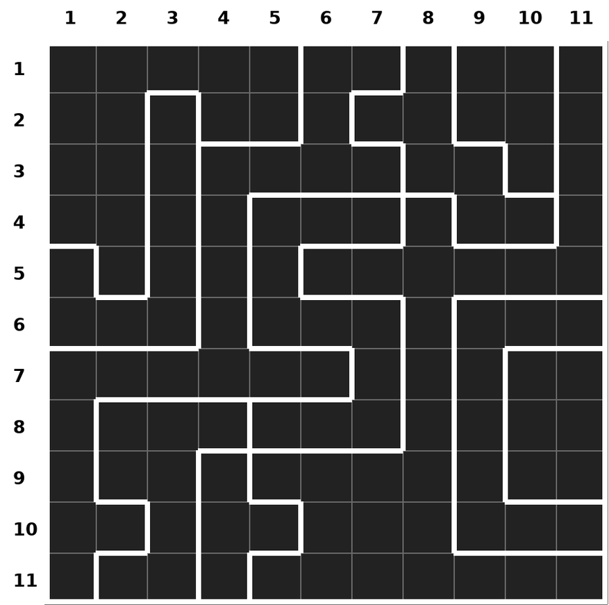
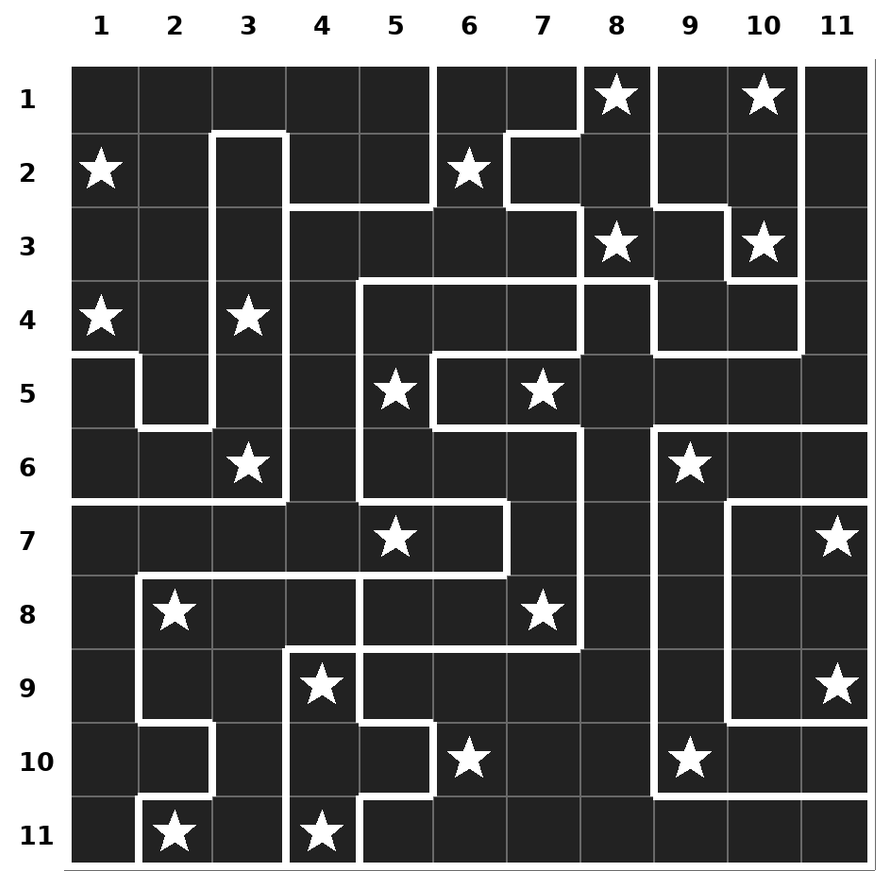

#### Note : 

    1. play.py uses <tkinter> and <math>, both are built-in Python modules, do not need to use pip install to get them.
    2. the puzzle is not timed, it auto closes once the puzzle is solved
    3. no clues provided in the game window
    4. to win, ensure you fill in the non-star elements too (mimicing below solved illustration will not auto-close to indicate puzzle solved)

----

#### Here's how the 11x11 Two-Not-Touch puzzle looks : 

----

#### Here's how the solved 11x11 Two-Not-Touch puzzle looks : 

----

#### Instructions to play the puzzle live: 

    git clone https://github.com/NotCleo/GDS-to-RTL.git
    cd GDS-to-RTL/TwoNotTouch-Interactive-Puzzle
    python3 play.py

#### If you want to play without cloning this repo : 

    mkdir puzzle-player
    cd puzzle-player
    <place the play.py file into puzzle-player>
    python3 play.py 
     
#### Once the game window opens : 

    single click : puts a dot / non-star element
    double click : puts a star element
    single click any element to remove it
    

----

#### There is now a browser version, which needs nothing installed :

[**notcleo.github.io/GDS-to-RTL/TwoNotTouch-Interactive-Puzzle/**](https://notcleo.github.io/GDS-to-RTL/TwoNotTouch-Interactive-Puzzle/)

It is one file, [`index.html`](index.html), with no scripts loaded from anywhere,
so it also works offline if you just open the file:

    git clone https://github.com/NotCleo/GDS-to-RTL.git
    xdg-open GDS-to-RTL/TwoNotTouch-Interactive-Puzzle/index.html

| | |
|---|---|
| single click | puts a dot |
| double click, or right click, or long press on a phone | puts a star |
| click a marked cell again | clears it |
| **Clear** | empties the board |
| **Fill obvious dots** | marks every cell a placed star already rules out |
| **Theme** | light or dark |

The line under the board is the verdict the **real chip** returns for the grid you
have placed. It reproduces all five of the messages the output ROM holds, and it
was checked against the five grids the solver pulled out of the netlist in stage
P10 of the pipeline, which agree on all five:

| verdict | when |
|---|---|
| `EMPTY SKY` | no stars placed |
| `BIG BANG` | every cell a star |
| `TRY AGAIN` | any ordinary wrong grid |
| `TWO NOT TOUCH` | every count right, and the only rule broken is the no-touch one |
| `(* TWO STARS *)` | the one grid the chip accepts |

Solve it and the tab closes itself. A tab your browser did not open from a script
cannot close itself, so if yours refuses, the page says so rather than sitting
there.
