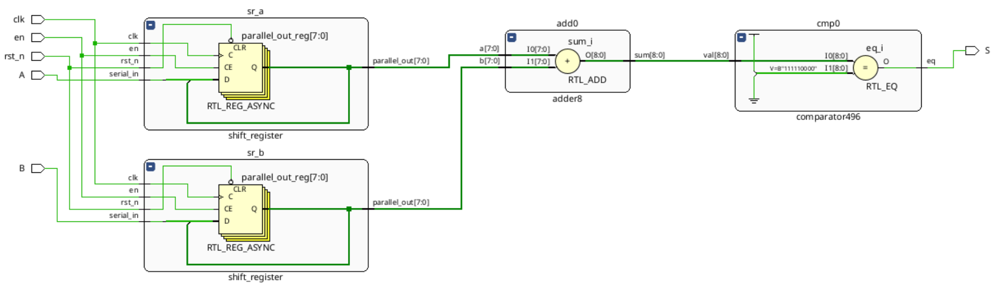
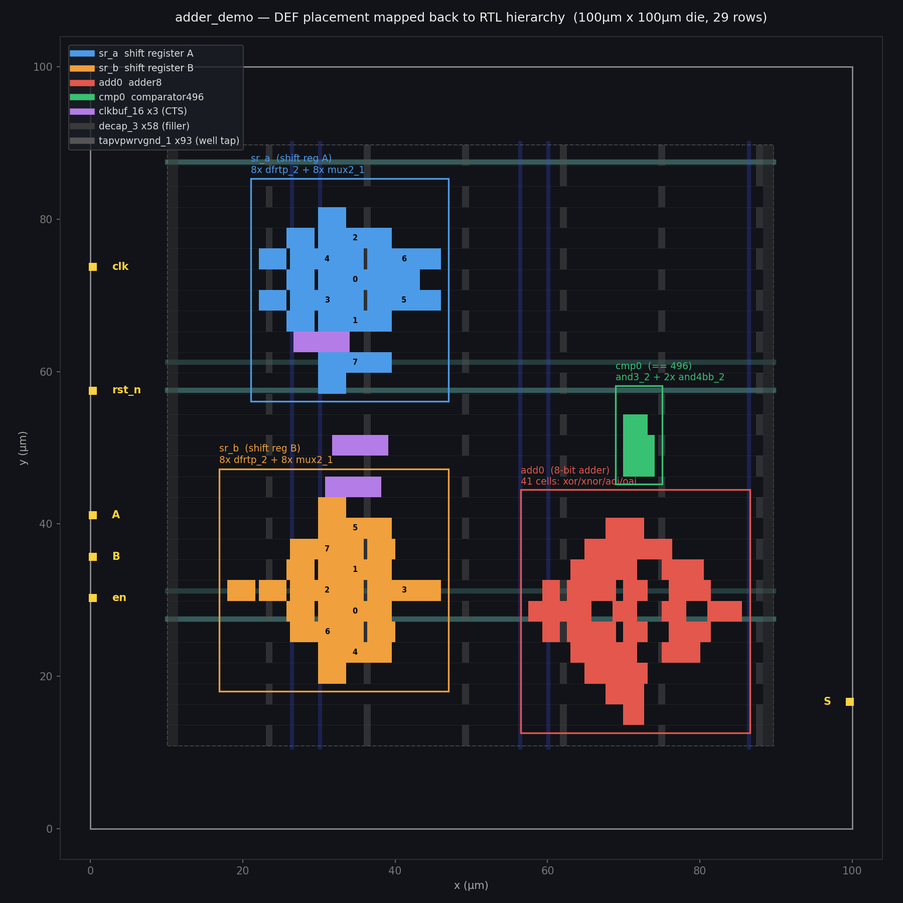

# The warm-up

Jane Street's practice design: two 8-bit shift registers, an adder and a
comparator, raising `success` when `A + B == 496`. It ships with the golden
source, netlist and DEF, so this is the only place the extractor can be checked
against the truth instead of against a plausibility argument.

Files `00_source.v` through `04_final.gds` are as supplied. `warmup-work/` holds
the run logs and the outputs from working through it.

----

#### See the schematic : 

----

#### See the GDS labelling : 

----

### Full breakdown found from Warmup Puzzle

#### Spatial Layout & Module Bounding Boxes

| Module | X Range (µm) | Y Range (µm) | Cell Count |
| :--- | :--- | :--- | :---: |
| `sr_a` (Shift Register A) | 22.08 – 46.00 | 57.12 – 84.32 | 16 |
| `sr_b` (Shift Register B) | 17.94 – 46.00 | 19.04 – 46.24 | 16 |
| `add0` (8-bit Adder) | 57.50 – 85.56 | 13.60 – 43.52 | 41 |
| `cmp0` (4-bit Comparator) | 69.92 – 74.06 | 46.24 – 57.12 | 3 |
| Clock Buffers | 26.68 – 39.10 | 43.52 – 68.00 | 3 |

---

### I/O Pin Directory & Placement

| Pin Name | Direction | Layer | Coordinates $(x, y)$ | Viewer Location |
| :--- | :---: | :---: | :---: | :--- |
| `clk` | Input | `met3` | (0.30, 73.78) | Left edge, upper |
| `rst_n` | Input | `met3` | (0.30, 57.46) | Left edge, upper-middle |
| `A` | Input | `met3` | (0.30, 41.14) | Left edge, middle |
| `B` | Input | `met3` | (0.30, 35.70) | Left edge, middle |
| `en` | Input | `met3` | (0.30, 30.26) | Left edge, lower-middle |
| `S` | Output | `met3` | (99.70, 16.66) | Right edge, lower |
| `VPWR` | Inout | `met4` / `met5` | (49.91, 87.53) | Power grid |
| `VGND` | Inout | `met4` / `met5` | (49.91, 61.23) | Power grid |

---

#### Standard Cell Breakdown & RTL Mapping

| Cell Type | Quantity | Associated RTL Construct |
| :--- | :---: | :--- |
| `dfrtp_2` | 16 | Flip-flops for `a_reg[7:0]` + `b_reg[7:0]` (*D Flip-Flop with active-low async reset `RESET_B`*) |
| `mux2_1` | 16 | `en` recirculation multiplexers |
| `xor2_2` (×5), `xnor2_2` (×3), `and2_2` (×7), `or2_2` (×5), `nor2_2` (×8), `nand2_2` (×4), `a31o_2` (×5), `a21bo_2` (×1), `a21o_2` (×1), `a21boi_2` (×1), `o21bai_2` (×1) | 41 | `add0` (8-bit adder), synthesized carry-lookahead-like structure |
| `and3_2` (×1), `and4bb_2` (×2) | 3 | `cmp0` (4-bit comparator) |
| `clkbuf_16` | 3 | Clock Tree Synthesis (CTS) buffers (*inserted post-RTL*) |
| `adder_demo` | 1 | Top-level module instance |

---

#### Sky130 Layer Stack & Reverse Engineering Roles

| Layer | Physical Description | Role in Reverse Engineering |
| :--- | :--- | :--- |
| `substrate` | p-type wafer bulk | Ignored |
| `nwell` | N-type well implant | Marks PMOS regions; identifies cell row boundaries |
| `diff` | Active/OD region (source & drain) | Critical for transistor extraction (`poly` ∩ `diff` = transistor channel) |
| `poly` | Polysilicon gate | Gate terminal; used for short intra-cell interconnects |
| `licon` | Contact from `li1` down to `diff`/`poly` | Critical terminal connection layer |
| `li1` | Local interconnect (TiN layer, Sky130 specific) | Standard cell internal routing and pin boundary access |
| `mcon` | `li1` → `met1` via | Interconnect stack transition |
| `met1` | Metal 1 | Horizontal power rails (`VPWR`/`VGND`) and short signal routes |
| `via` | `met1` → `met2` via | Vertical routing transition |
| `met2` | Metal 2 | Preferred vertical signal routing layer |
| `via2` / `met3` | Metal 3 & via | Preferred horizontal routing; contains top-level I/O pins |
| `via3` / `met4` | Metal 4 & via | Vertical power grid (PDN) straps |
| `via4` / `met5` | Metal 5 & via | Horizontal power grid (PDN) straps (*thick metal layer*) |
| `capm` / `cap2m` | MiM capacitor plates | Metal-insulator-metal capacitors (*unused in this design*) |

---

#### Physical / Non-Logic Standard Cells

| Cell Name | Count | Purpose | Electrically Active? |
| :--- | :---: | :--- | :---: |
| `sky130_fd_sc_hd__decap_3` | 58 | Decoupling capacitor (MOSCAP). Damps $di/dt$ power droop and fills row gaps for continuous well implants. | Yes (Capacitive only) |
| `sky130_fd_sc_hd__tapvpwrvgnd_1` | 93 | Well tap / substrate tie (`nwell` to `VPWR`, substrate to `VGND`). Prevents latch-up. | Yes (DC tie) |
| `sky130_fd_sc_hd__fill_*` | 0 | Metal/diffusion density fill for CMP planarity. | No |
| `sky130_fd_sc_hd__diode_2` | 0 | Antenna diode for process antenna protection during fabrication. | No (Active only during fab) |

---

#### Design Flow File Hierarchy & Abstraction Loss

| File Name | Content | Information Lost in Abstraction |
| :--- | :--- | :--- |
| `00_source.v` | Behavioral RTL, module hierarchy, bit vectors | none |
| `01_netlist.v` | 230 standard cell instances (flattened, preserving instance prefixes like `sr_a/`, `add0/`) | High-level operators (`+`, `==`), vector semantics |
| `02_netlist_with_power_rails.v` | Explicit power/ground connectivity (`.VPWR`, `.VGND`, `.VPB`, `.VNB`) | None (*Explicit format prepared for LVS*) |
| `03_post_place_and_route.def` | Physical coordinates $(x,y)$, orientation, routed metal segments, PDN layout | none |
| `04_final.gds` | Physical polygons only | Cell instance names, net names, module hierarchy, pin names |
